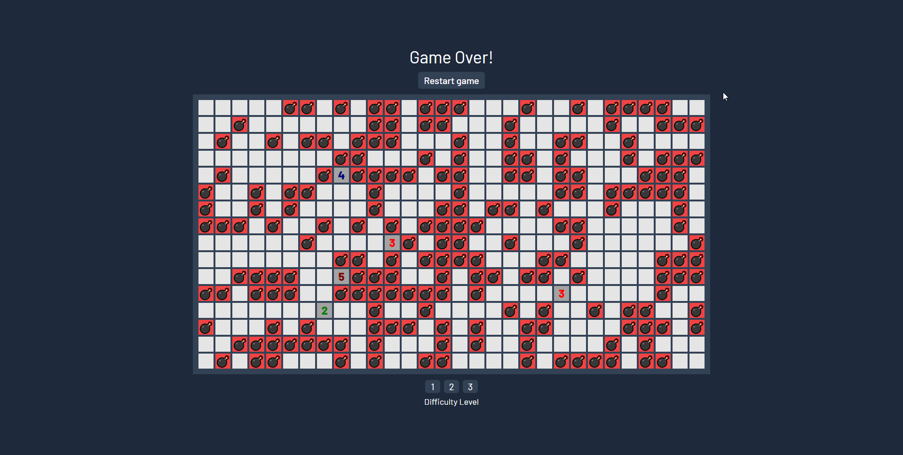

# MinesweeperTS

  

### <a href="https://karolstawowski.github.io/MinesweeperTS/">Click here to see website!</a>

## Description

Here's my <b>React/TypeScript</b> implementation of popular game called 'Minesweeper' made by Robert Donner.
The objective of the game is to open all cells of the game board which are not mines.

<a href="https://en.wikipedia.org/wiki/Minesweeper_(video_game)">Here are full game rules.</a>

## Tools and technologies

React, TypeScript, Vite, tabler-icons.
